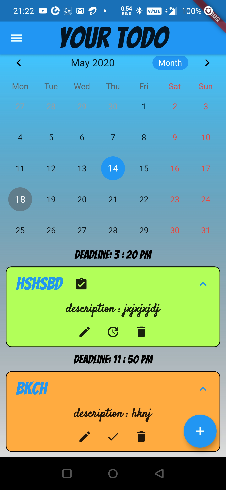

# todo
 

A new Flutter application which keeps storage of what u want to do in future.

Installation Method Using Android Studio
 * This App runs on latest flutter sdk if not updated please update
 * Copy the Clone link 
 * Open Android Studio Welcome Page, Select: check out project from Version Control  
 * Select : git
 * Paste the clone link then Select: clone
 * if asked login details enter username and password 
 * go back to Welcome screen ,Select: open existing android studio project
 * go to the address of project and select the project
 * when project window opens Terminal and execute the command : flutter pub get
 * or u can go to pubspec.yaml and click on Pub Get
 * Start Android emulator or connect to a physical device
 * Press on the Play Button To Launch The App 

Home screen

Ways to Use
* first select a day from callender
* to add todo press on + button at bottum
* to expand todo press on title
* to update  todo press on edit button
* to delete press on delete icon 
* to mark as completed or un completed press on done button
